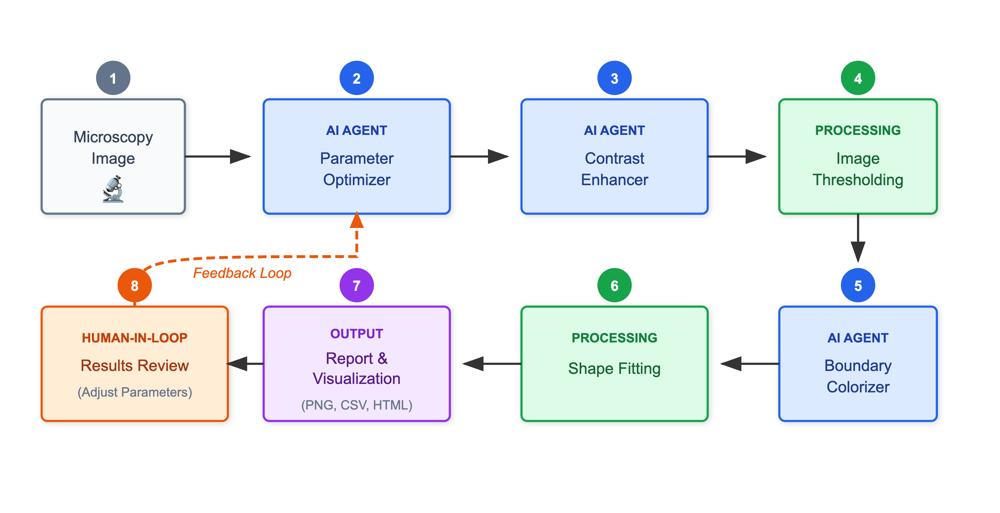

# NanORange

<p align="center">
  
</p>

<p align="center">
  <strong>AI-Powered Nanoparticle Analysis for Microscopy Images</strong>
</p>

<p align="center">
  <a href="#features">Features</a> •
  <a href="#how-it-works">How It Works</a> •
  <a href="#installation">Installation</a> •
  <a href="#usage">Usage</a> •
  <a href="#tech-stack">Tech Stack</a>
</p>

---

## Overview

NanORange is an AI-powered platform that automates the analysis of microscopy images to detect and measure nanoparticles. Using multiple specialized AI agents, it processes images through a sophisticated pipeline that enhances, segments, and extracts geometric measurements from nanoparticle samples.

## Features

- **AI-Powered Analysis** - Multiple specialized agents for parameter optimization, contrast enhancement, and boundary detection
- **Automated Shape Detection** - Fits circles and ellipses to detected nanoparticles with high precision
- **Rich Visualizations** - Generates annotated images, interactive HTML plots, and size distribution histograms
- **Conversational Interface** - Natural language chat interface for easy interaction
- **Human-in-the-Loop** - Review results and adjust parameters through conversation
- **Multiple Output Formats** - Export results as PNG, CSV, and interactive HTML

## How It Works

<p align="center">
  
</p>

### Pipeline Steps

| Step  | Component              | Description                                                            |
| ----- | ---------------------- | ---------------------------------------------------------------------- |
| **1** | 📤 Microscopy Image    | Upload your image (JPG, PNG, TIFF)                                     |
| **2** | 🤖 Parameter Optimizer | AI analyzes image characteristics and suggests optimal hyperparameters |
| **3** | 🤖 Contrast Enhancer   | AI-powered denoising and contrast enhancement                          |
| **4** | ⚙️ Image Thresholding  | Otsu's adaptive thresholding for binary segmentation                   |
| **5** | 🤖 Boundary Colorizer  | AI assigns unique colors to differentiate particle boundaries          |
| **6** | ⚙️ Shape Fitting       | Fit circles & ellipses, extract geometric measurements                 |
| **7** | 📊 Report Generation   | Generate annotated images, CSV data, and interactive plots             |
| **8** | 👤 Human Review        | Review results and optionally adjust parameters                        |

## Installation

### Requirements

- Python `>=3.11,<3.12`
- Node.js `>=18` (for frontend)

### Backend Setup

```bash
git clone https://github.com/yourusername/NanORange.git
cd NanORange

python3.11 -m venv .venv

source .venv/bin/activate  # macOS/Linux
# .venv\Scripts\activate   # Windows

pip install --upgrade pip
pip install -r requirements.txt
```

### Frontend Setup

```bash
cd frontend
npm install
```

### Environment Variables

Create a `.env` file in the root directory:

```env
GOOGLE_API_KEY=your_google_api_key_here
```

## Usage

### Starting the Application

**Terminal 1 — Start the API server:**

```bash
source .venv/bin/activate
python -m api.run
```

**Terminal 2 — Start the frontend:**

```bash
cd frontend
npm run dev
```

Open your browser and navigate to `http://localhost:3000`

### Analyzing Images

1. **Upload** - Drag and drop or select a Cryo-TEM image
2. **Analyze** - Ask the AI to analyze your image in the chat
3. **Review** - Examine the generated visualizations and measurements
4. **Refine** - Adjust parameters through conversation if needed

## Output Structure

```
output/
├── 1_tiles/          # Original image tiles
├── 2_enhanced/       # Contrast-enhanced tiles
├── 3_thresholded/    # Binary thresholded tiles
├── 4_colorized/      # Colorized particle boundaries
└── 5_shapes/         # Final outputs
    ├── detected_shapes.csv       # Shape measurements
    ├── original_with_shapes.png  # Annotated original
    ├── size_distribution.png     # Size histogram
    └── *.html                    # Interactive plots
```

## Tech Stack

| Category             | Technologies                                   |
| -------------------- | ---------------------------------------------- |
| **AI Framework**     | Google ADK (Agent Development Kit)             |
| **LLM Models**       | Gemini 2.5 Flash, Gemini 2.0 Flash Exp         |
| **Image Processing** | OpenCV, PIL, NumPy, scikit-learn, scikit-image |
| **Visualization**    | Plotly, Matplotlib                             |
| **Backend**          | FastAPI, Python                                |
| **Frontend**         | Next.js, React, TypeScript                     |

## Project Structure

```
NanORange/
├── api/                    # FastAPI backend
│   └── routes/             # API endpoints
├── frontend/               # Next.js frontend
│   └── src/app/            # React components
├── src/nanorange/          # Core analysis library
│   ├── agent_tools/        # Tools exposed to AI agent
│   ├── image_analyzer/     # Processing modules
│   │   ├── analyzer_agent/ # AI-powered processors
│   │   ├── geometry_fitter/# Shape detection
│   │   ├── plotter/        # Visualization
│   │   └── tools/          # Image utilities
│   └── pipelines/          # Workflow orchestration
├── docs/                   # Documentation
├── examples/               # Example scripts
└── output/                 # Generated results
```

## License

This project is licensed under the MIT License - see the [LICENSE](LICENSE) file for details.

---

<p align="center">
  Made with 🍊 for the scientific community
</p>
